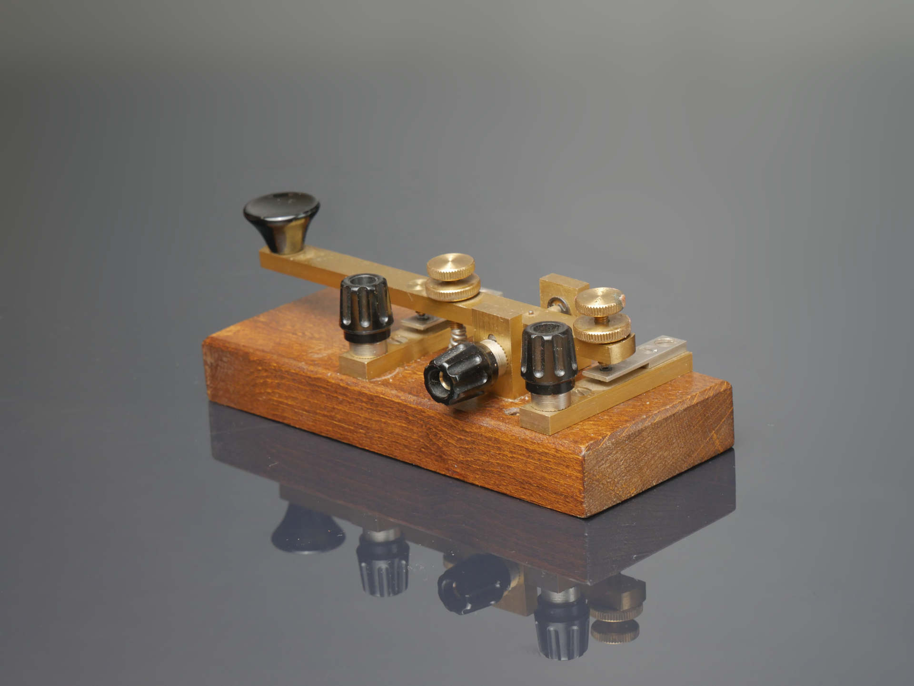

# RP2040 Morse Code Keyboard

This project contains all necessary files to build your own morse button to USB keyboard.

## Preface

A long time ago I found this beautiful morse key on a local flee market.

As I am a licensed HAM operator I thought about getting into CW low power operation.
But i don't know morse code an I live in a space where operating antennas outside of my apartment is just not feasible.
So it went down to the basement for a several years.

It is currently winter here in northern germany adn weather is like shit,
so I thought about doing some nice diy projects to entertain myself.

Years ago I did a lot of arduino (atmega328p, attiny,
etc.) [projects](https://github.com/RincewindWizzard/magic-switchboard/tree/master).
Recently I stumbled across the
new [RP2040 Raspberry Pico boards](https://www.waveshare.com/wiki/RP2040-Zero#Specification).
They have an interesting new Feature: USB HID Modes.
This chip can emulate an usb keyboard to the host system, which gives you vast possibilities in the world of custom
joysticks.

This project is one of those: A USB keyboard where you have to input morse code to enter your chars.

## Build Software

The software part is build using  [platformio](https://platformio.org/).
See their [installation guide](https://docs.platformio.org/en/latest/core/installation/index.html).
There is also a good [jetbrains plugin](https://www.jetbrains.com/help/clion/platformio.html) for CLion.
If your Rp2040 is connected you just run:

    pio run -t upload -e pico

to build and upload this code.

## Build PCB

Schematics, PCB layout and 3d models will be found in the [CAD](./CAD/) folder once they are ready.

